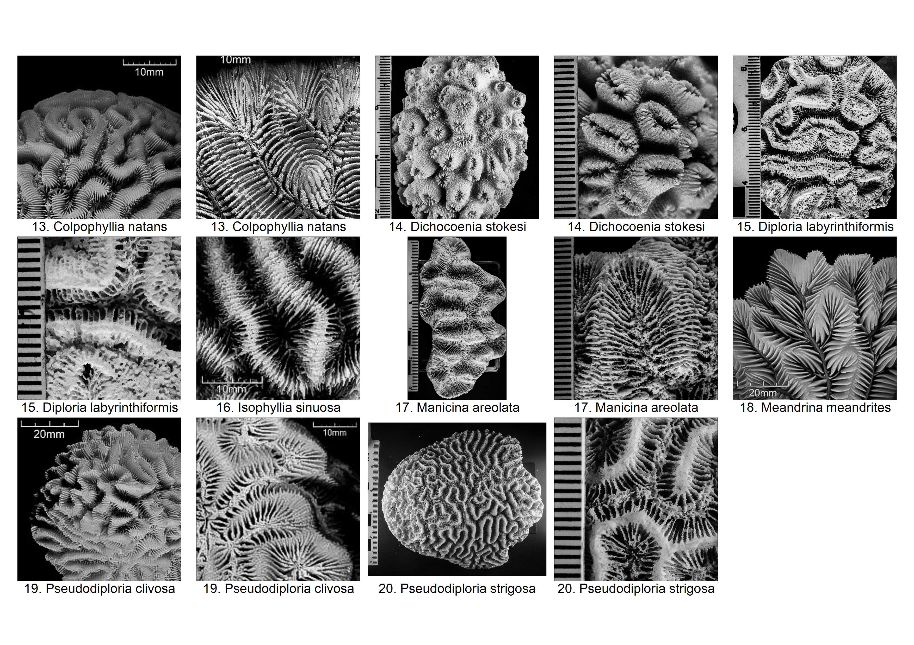
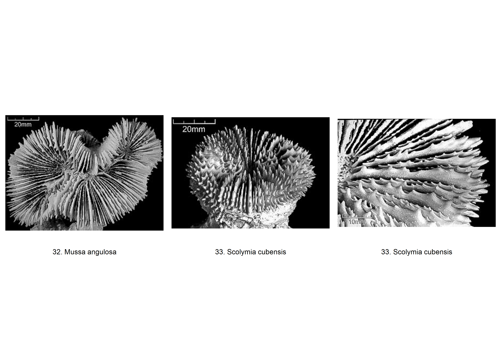
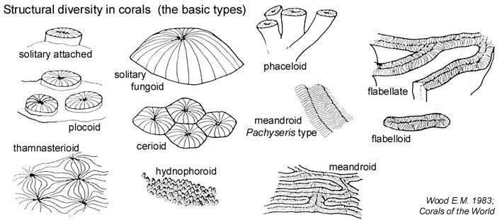

```{r LOAD AND SET UP, echo=FALSE, warning=FALSE}
knitr::opts_chunk$set(echo = FALSE, warning = FALSE, message = FALSE)
source("libraries & tables.R")
```

# Read Me 

1. The Caribbean Coral Skeleton Identification Guide (CCSIG) is an identification guide that is based on the physical characteristics of coral skeletons.

2. The CCSIG currently (as of August 31, 2016) contains most of the species that can be found in Bocas del Toro, Panama.
    + Contributions to further expand the taxonomic and geographic range of this guide are highly encouraged (please see No. 5 for contact information).
  
3. Information in the tables was obtained from [Corals of the World](http://coral.aims.gov.au/info/factsheets.jsp), [Coralpedia](http://coralpedia.bio.warwick.ac.uk/) and various other sources (see References and Additional Resources). 
    + Grouping of species is based on their growth forms
  
4. Images of coral skeleton (colony, corallite and/or valley) were taken from coral specimens from the reference collection of coral skeleton (Caribbean Coral Skeleton Reference Collection, CCSRC) at the Naos Marine Laboratory, Smithsonian Tropical Research Institute, Panama. 
    + Images of species that are not available (as of August 31, 2016) in the CCSRC or do not have well-preserved specimens were obtained from [Corals of the World](http://coral.aims.gov.au/info/factsheets.jsp) instead. 
    + Each image has a scale of either:
        + a strip of horizontal lines (or a ruler) with 1mm intervals (Images taken from the CCSRC) 
        + a digitized scale located in one of the corners of the image (Images from Corals of the World)
    + Labels of the images correspond with the row number and name of the species in the subsequent tables. 
    + An online version of the images with higher resolution is available [here](http://ccsig.github.io/gallery/)
  
5. To make suggestions/comments, please contact:
    + Melisa Chan – melisacbl@gmail.com
    + Nicthe-Ha Muñoz – nicteha.limno@gmail.com
    +	Mauro Lepore – maurolepore@gmail.com

Click [here](https://github.com/ccsig/ccsig.github.io/blob/master/ccsig.pdf) for a printable version of this guide

# Characteristics of Coral Species {.tabset .tabset-fade .tabset-pills}

## Branching Corals


```{r BRANCHING}

branch <- infodf[1:11, -c(2,6,7,15),drop=FALSE]
DT::datatable(branch)

```

*******************

## Lumpy Corals


*******************

```{r LUMPY}

lumpy <- infodf[12, -c(2,6,7,14,15),drop=FALSE]
DT::datatable(lumpy)

```

*******************

## Massive Brains Corals



*******************

```{r MASSIVE BRAINS}

mbrains <- infodf[13:20,-c(2,3,14,15),drop=FALSE]
DT::datatable(mbrains)

```

*******************

## Massive Star Corals


*******************

```{r MASSIVE STAR}

mstar <- infodf[21:31,-c(2,14),drop=FALSE]
DT::datatable(mstar)

```

*******************

## Solitary Corals



*******************

```{r SOLITARY}

solitary <- infodf[32:33,-c(2,13,14,15),drop=FALSE]
DT::datatable(solitary)

```

*******************

## Thick Leafy Corals


*******************

```{r THICK LEAFY}

tkleafy <- infodf[34:37, -c(2,14,15),drop=FALSE]
DT::datatable(tkleafy)

```

*******************

## Thin Leafy Corals


*******************

```{r THIN LEAFY}

tnleafy <- infodf[38:44, -c(2,14),drop=FALSE]
DT::datatable(tnleafy)
```

*******************

# Glossary of Coral Morphology



*******************


*******************


*******************

```{r GLOSSARY}

DT::datatable(morphdf)

```

*******************

# References and Additional Resources

* Coral Taxonomy
    + http://www.marinespecies.org/index.php
    
* Coral Species ID
    + http://coral.aims.gov.au/info/factsheets.jsp
    + http://eusmilia.geology.uiowa.edu/nmita/generaList.page?classification=NMITA&taxonName=Zooxanthellate+Coral&getGenButton=Get+Genera
    + http://coralpedia.bio.warwick.ac.uk/
    + https://www.stri.si.edu/english/PDFs/201215_Hard_Coral_Identification_guide.pdf
    + http://eusmilia.geology.uiowa.edu/idstep1.htm
    + http://species-identification.org/index.php
    + Budd, Ann F., and Jarosław Stolarski. "Searching for New Morphological Characters in the Systematics of Scleractinian Reef Corals: Comparison of Septal Teeth and Granules between Atlantic and Pacific Mussidae." Acta Zoologica 90.2 (2009): 142-65. Web. 23 June 2016.
    + http://digital.lib.uiowa.edu/cdm/search/collection/coral

* Glossary of Coral Morphology
    + http://biophysics.sbg.ac.at/png/png3.htm
    + http://eusmilia.geology.uiowa.edu/database/corals/glossary/glossmnu.htm
    + http://www.coralhub.info/terms/corallite/
    + http://tolweb.org/Dendrophylliidae/19165
    + http://www.cap-recifal.com/page/articles.html/_/vivant/identification-des-scl%C3%A9ractiniaires-r44
    


