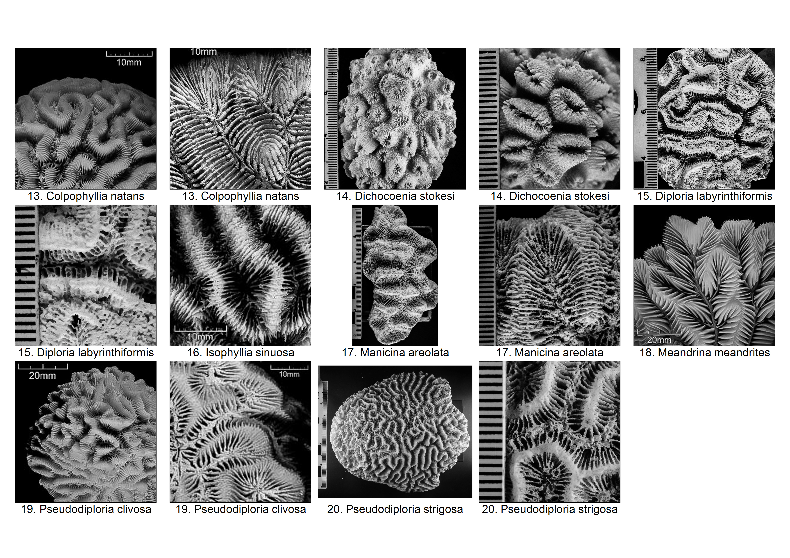
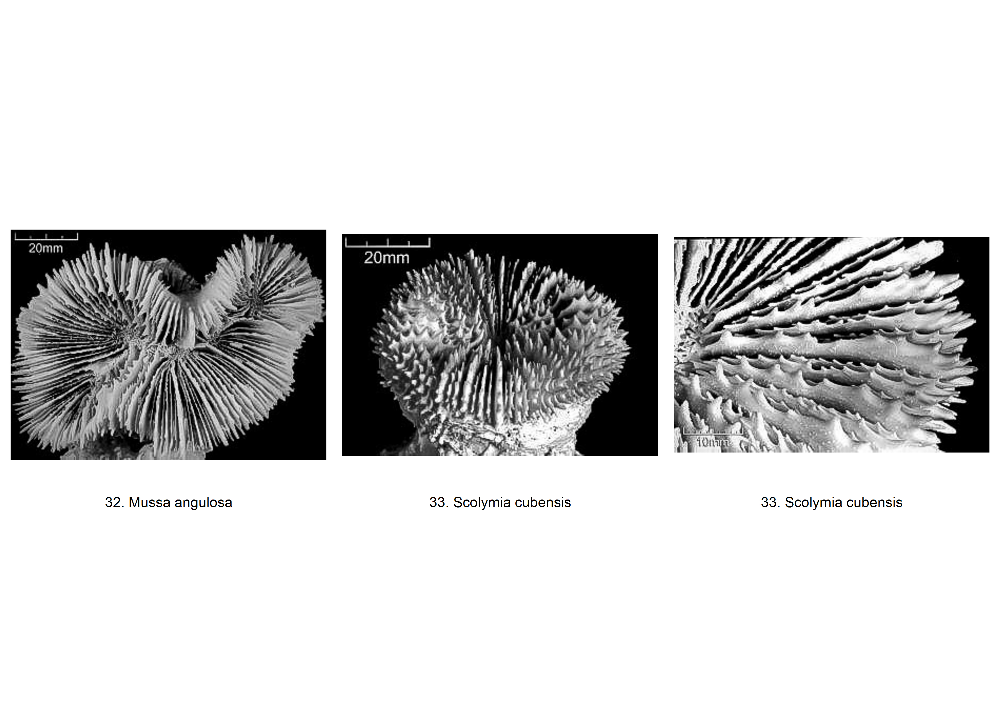
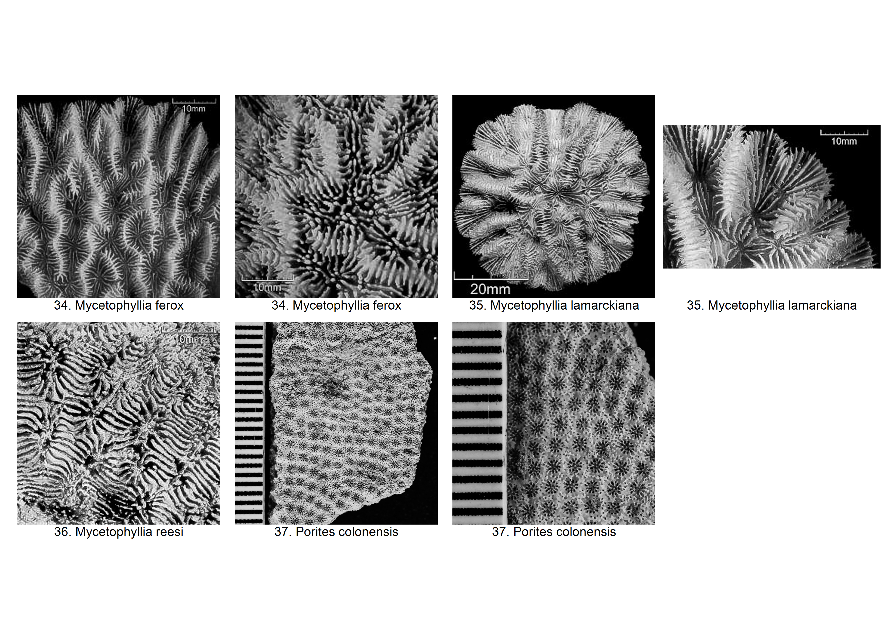

```{r LOAD AND SET UP, echo=FALSE, warning=FALSE, fig.cap=FALSE}
knitr::opts_chunk$set(echo = FALSE, warning = FALSE, message = FALSE, cache = FALSE, results='asis')
source("libraries & tables.R")

```

# Read Me

The Caribbean Coral Skeleton Identification Guide (CCSIG) is an updated version of a previous identification guide created by Mauro Lepore. The previous identification guide is basically a compilation of images and descriptions of Caribbean coral species skeletons from Corals of the World grouped into suggested categories of growth forms from Coralpedia.

While the previous identification guide provided helpful information and images for coral identification, it was still lacking in more detailed information and organization. Due to this, the user would have to follow the provided links in the previous guide or search the web for additional resources that may contain more information and detailed images. This resulted in more time spent in looking for and accessing additional resources than in the identification of corals itself.

To mitigate this problem, we decided to revise the previous identification guide to include information from those additional resources that were accessed, merging and compiling them in tables of information based on their growth forms. New images of coral skeleton were also taken from coral specimens from the Caribbean Coral Skeleton Reference Collection (CCSRC) at the Naos Marine Laboratory, Smithsonian Tropical Research Institute, Panama. Images from Corals of the World were used for species that are not yet available in the CCSRC. The images have been edited in Photoshop Lightroom to better exhibit their physical characteristics. Each image has a scale of either:

* a strip of horizontal lines (or a ruler) with 1mm intervals (Images taken from the CCSRC) 

* a digitized scale  located in one of the corners of the imag (Images from Corals of the World)

The images of the coral skeleton have been labeled with a number (corresponds with their row number in the tables) and their species name. They have all been arranged numerically and alphabetically. Each coral species has an image of its colony and/or corallite/valley.

Additionally, a verbal and visual (where necessary) glossary of coral morphology is included to help better illustrate the characteristics described in the tables.

We hope that this updated version will make the identification of coral species based on their skeletal characteristics easier and more efficient. For a physical and more tangible resource of identification, please visit the CCSRC at the Naos Marine Laboratory (insert web link here)

\newpage

# Characteristics of Coral Species

## Branching Corals

\includegraphics[height=800pt]{C:/Users/User/Dropbox/R/STRI - CORAL ID GUIDE/branching.jpg}

\newpage

```{r BRANCHING, fig.pos="p"}

branch <- infodf[1:11, -c(2,6,7,15),drop=FALSE]
branchx <- xtable(branch, align = c("p{0.001\\textwidth}",
                                    "p{0.13\\textwidth}",
                                    "p{0.08\\textwidth}",
                                    "p{0.08\\textwidth}",
                                    "p{0.08\\textwidth}",
                                    "p{0.08\\textwidth}",
                                    "p{0.08\\textwidth}",
                                    "p{0.03\\textwidth}",
                                    "p{0.08\\textwidth}",
                                    "p{0.08\\textwidth}",
                                    "p{0.08\\textwidth}",
                                    "p{0.06\\textwidth}",
                                    "p{0.06\\textwidth}",
                                    "p{0.15\\textwidth}",
                                    "p{0.30\\textwidth}"))
print(branchx, scalebox = 0.5, size = "\\setlength{\\tabcolsep}{12pt}")

```

\newpage

## Lumpy Corals

\includegraphics[height=200pt]{C:/Users/User/Dropbox/R/STRI - CORAL ID GUIDE/lumpy.jpg}

```{r LUMPY}

lumpy <- infodf[12, -c(2,6,7,14,15),drop=FALSE]
lumpyx <- xtable(lumpy, align = c("p{0.001\\textwidth}",
                                  "p{0.13\\textwidth}",
                                  "p{0.08\\textwidth}",
                                  "p{0.08\\textwidth}",
                                  "p{0.08\\textwidth}",
                                  "p{0.08\\textwidth}",
                                  "p{0.08\\textwidth}",
                                  "p{0.03\\textwidth}",
                                  "p{0.08\\textwidth}",
                                  "p{0.08\\textwidth}",
                                  "p{0.08\\textwidth}",
                                  "p{0.06\\textwidth}",
                                  "p{0.15\\textwidth}",
                                  "p{0.30\\textwidth}"))
print(lumpyx, scalebox = 0.5, size = "\\setlength{\\tabcolsep}{12pt}")

```

\newpage

## Massive Brains Corals



\newpage

```{r MASSIVE BRAINS}

mbrains <- infodf[13:20,-c(2,3,14,15),drop=FALSE]
mbrainsx <- xtable(mbrains, align = c("p{0.001\\textwidth}",
                                      "p{0.13\\textwidth}",
                                      "p{0.08\\textwidth}",
                                      "p{0.08\\textwidth}",
                                      "p{0.08\\textwidth}",
                                      "p{0.08\\textwidth}",
                                      "p{0.08\\textwidth}",
                                      "p{0.03\\textwidth}",
                                      "p{0.08\\textwidth}",
                                      "p{0.08\\textwidth}",
                                      "p{0.08\\textwidth}",
                                      "p{0.08\\textwidth}",
                                      "p{0.06\\textwidth}",
                                      "p{0.15\\textwidth}",
                                      "p{0.30\\textwidth}"))
print(mbrainsx, scalebox = 0.5, size = "\\setlength{\\tabcolsep}{12pt}")

```

\newpage

## Massive Star Corals


\newpage

```{r MASSIVE STAR}

mstar <- infodf[21:31,-c(2,14),drop=FALSE]
mstarx <- xtable(mstar, align = c("p{0.001\\textwidth}",
                                  "p{0.13\\textwidth}",
                                  "p{0.08\\textwidth}",
                                  "p{0.08\\textwidth}",
                                  "p{0.08\\textwidth}",
                                  "p{0.08\\textwidth}",
                                  "p{0.08\\textwidth}",
                                  "p{0.08\\textwidth}",
                                  "p{0.08\\textwidth}",
                                  "p{0.03\\textwidth}",
                                  "p{0.08\\textwidth}",
                                  "p{0.08\\textwidth}",
                                  "p{0.08\\textwidth}",
                                  "p{0.08\\textwidth}",
                                  "p{0.06\\textwidth}",
                                  "p{0.15\\textwidth}",
                                  "p{0.30\\textwidth}"))
print(mstarx, scalebox = 0.5, size = "\\setlength{\\tabcolsep}{12pt}")

```

\newpage

## Solitary Corals



\newpage

```{r SOLITARY}

solitary <- infodf[32:33,-c(2,13,14,15),drop=FALSE]
solitaryx <- xtable(solitary, align = c("p{0.001\\textwidth}",
                                        "p{0.13\\textwidth}",
                                        "p{0.08\\textwidth}",
                                        "p{0.08\\textwidth}",
                                        "p{0.08\\textwidth}",
                                        "p{0.08\\textwidth}",
                                        "p{0.08\\textwidth}",
                                        "p{0.03\\textwidth}",
                                        "p{0.08\\textwidth}",
                                        "p{0.08\\textwidth}",
                                        "p{0.08\\textwidth}",
                                        "p{0.08\\textwidth}",
                                        "p{0.06\\textwidth}",
                                        "p{0.15\\textwidth}",
                                        "p{0.30\\textwidth}"))
print(solitaryx, scalebox = 0.5, size = "\\setlength{\\tabcolsep}{12pt}")

```

\newpage

## Thick Leafy Corals



\newpage

```{r THICK LEAFY}

tkleafy <- infodf[34:37, -c(2,14,15),drop=FALSE]
tkleafyx <- xtable(tkleafy, align = c("p{0.001\\textwidth}",
                                      "p{0.13\\textwidth}",
                                      "p{0.08\\textwidth}",
                                      "p{0.08\\textwidth}",
                                      "p{0.08\\textwidth}",
                                      "p{0.08\\textwidth}",
                                      "p{0.08\\textwidth}",
                                      "p{0.03\\textwidth}",
                                      "p{0.08\\textwidth}",
                                      "p{0.08\\textwidth}",
                                      "p{0.08\\textwidth}",
                                      "p{0.08\\textwidth}",
                                      "p{0.08\\textwidth}",
                                      "p{0.06\\textwidth}",
                                      "p{0.15\\textwidth}",
                                      "p{0.30\\textwidth}"))
print(tkleafyx, scalebox = 0.5, size = "\\setlength{\\tabcolsep}{12pt}")
```

\newpage

## Thin Leafy Corals


\newpage

```{r THIN LEAFY}

tnleafy <- infodf[38:44, -c(2,14),drop=FALSE]
tnleafyx <- xtable(tnleafy, align = c("p{0.001\\textwidth}",
                                      "p{0.13\\textwidth}",
                                      "p{0.08\\textwidth}",
                                      "p{0.08\\textwidth}",
                                      "p{0.08\\textwidth}",
                                      "p{0.08\\textwidth}",
                                      "p{0.08\\textwidth}",
                                      "p{0.03\\textwidth}",
                                      "p{0.08\\textwidth}",
                                      "p{0.08\\textwidth}",
                                      "p{0.08\\textwidth}",
                                      "p{0.08\\textwidth}",
                                      "p{0.08\\textwidth}",
                                      "p{0.08\\textwidth}",
                                      "p{0.06\\textwidth}",
                                      "p{0.15\\textwidth}",
                                      "p{0.30\\textwidth}"))
print(tkleafyx, scalebox = 0.5, size = "\\setlength{\\tabcolsep}{12pt}")

```

\newpage

# Glossary of Coral Morphology


\newpage

```{r GLOSSARY}

xtable(morphdf)

```

\newpage

# List of References

* Coral Taxonomy
    + http://www.marinespecies.org/index.php
    
* Coral Species ID
    + http://coral.aims.gov.au/info/factsheets.jsp
    + http://eusmilia.geology.uiowa.edu/nmita/generaList.page?classification=NMITA&taxonName=Zooxanthellate+Coral&getGenButton=Get+Genera
    + http://coralpedia.bio.warwick.ac.uk/
    + https://www.stri.si.edu/english/PDFs/201215_Hard_Coral_Identification_guide.pdf
    + http://eusmilia.geology.uiowa.edu/idstep1.htm
    + http://species-identification.org/index.php
    + Budd, Ann F., and Jarosław Stolarski. "Searching for New Morphological Characters in the Systematics of Scleractinian Reef Corals: Comparison of Septal Teeth and Granules between Atlantic and Pacific Mussidae." Acta Zoologica 90.2 (2009): 142-65. Web. 23 June 2016.

* Glossary of Coral Morphology
    + http://biophysics.sbg.ac.at/png/png3.htm
    + http://eusmilia.geology.uiowa.edu/database/corals/glossary/glossmnu.htm
    + http://www.coralhub.info/terms/corallite/
    