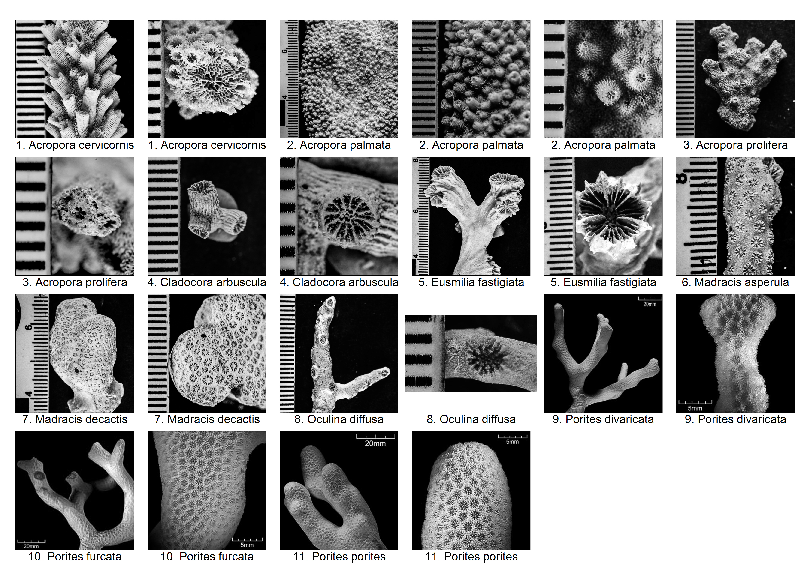

```{r LOAD AND SET UP, echo=FALSE, warning=FALSE}
knitr::opts_chunk$set(echo = FALSE, warning = FALSE, message = FALSE, cache = FALSE, results='asis')
source("libraries & tables.R")

```

# Characteristics of Coral Species

## Branching Corals



```{r test1}
test <- data.frame(read.csv("info.tsv", sep = "\t"))
testb <- test[,1:12]
xrescale <- xtable(testb, align = c("p{0.01\\textwidth}",
                                    "p{0.13\\textwidth}",
                                    "p{0.13\\textwidth}",
                                    "p{0.13\\textwidth}",
                                    "p{0.13\\textwidth}",
                                    "p{0.13\\textwidth}",
                                    "p{0.13\\textwidth}",
                                    "p{0.13\\textwidth}",
                                    "p{0.13\\textwidth}",
                                    "p{0.13\\textwidth}",
                                    "p{0.13\\textwidth}",
                                    "p{0.13\\textwidth}",
                                    "p{0.13\\textwidth}"))
print(xrescale, include.rownames = FALSE, scalebox = 0.5, size = "\\setlength{\\tabcolsep}{12pt}")

```

```{r test2}

infodf <- data.frame(
  read.csv("info1.tsv", 
           sep = "\t"), 
  stringsAsFactors = FALSE)
names(infodf) <- c("Species Name", 
                   "Colony Shape", 
                   "Corallite Size (mm)", 
                   "Corallite Wall Thickness", 
                   "Columellae size (mm)", 
                   "Valley width (mm)", 
                   "No. of Centers per Series", 
                   "Septa Number", 
                   "Septal Cycle", 
                   "Septal Teeth", 
                   "Columella",
                   "Costae", 
                   "Coesnosteum",
                   "Branch diameter (cm)",
                   "Surface",
                   "Colony Form",
                   "Similar Species",
                   "Comments/Notes")
branch <- infodf[1:11, -c(6,7,15),drop=FALSE]
xrescale2 <- xtable(branch, align = c("p{0.001\\textwidth}",
                                    "p{0.13\\textwidth}",
                                    "p{0.08\\textwidth}",
                                    "p{0.08\\textwidth}",
                                    "p{0.08\\textwidth}",
                                    "p{0.08\\textwidth}",
                                    "p{0.08\\textwidth}",
                                    "p{0.08\\textwidth}",
                                    "p{0.03\\textwidth}",
                                    "p{0.08\\textwidth}",
                                    "p{0.08\\textwidth}",
                                    "p{0.08\\textwidth}",
                                    "p{0.06\\textwidth}",
                                    "p{0.06\\textwidth}",
                                    "p{0.15\\textwidth}",
                                    "p{0.30\\textwidth}"))
print(xrescale2, scalebox = 0.5, size = "\\setlength{\\tabcolsep}{12pt}")

```


